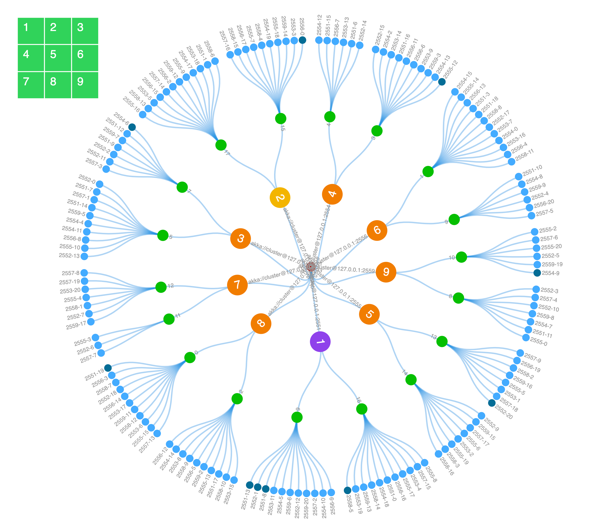
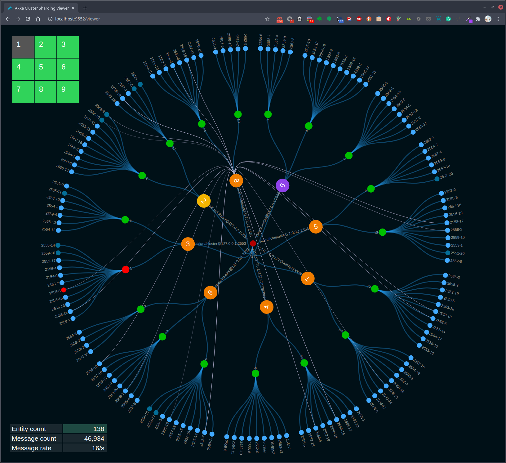
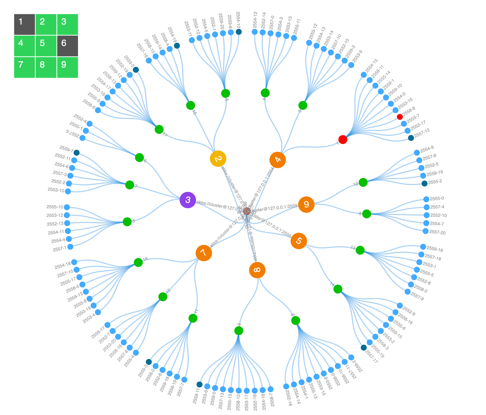
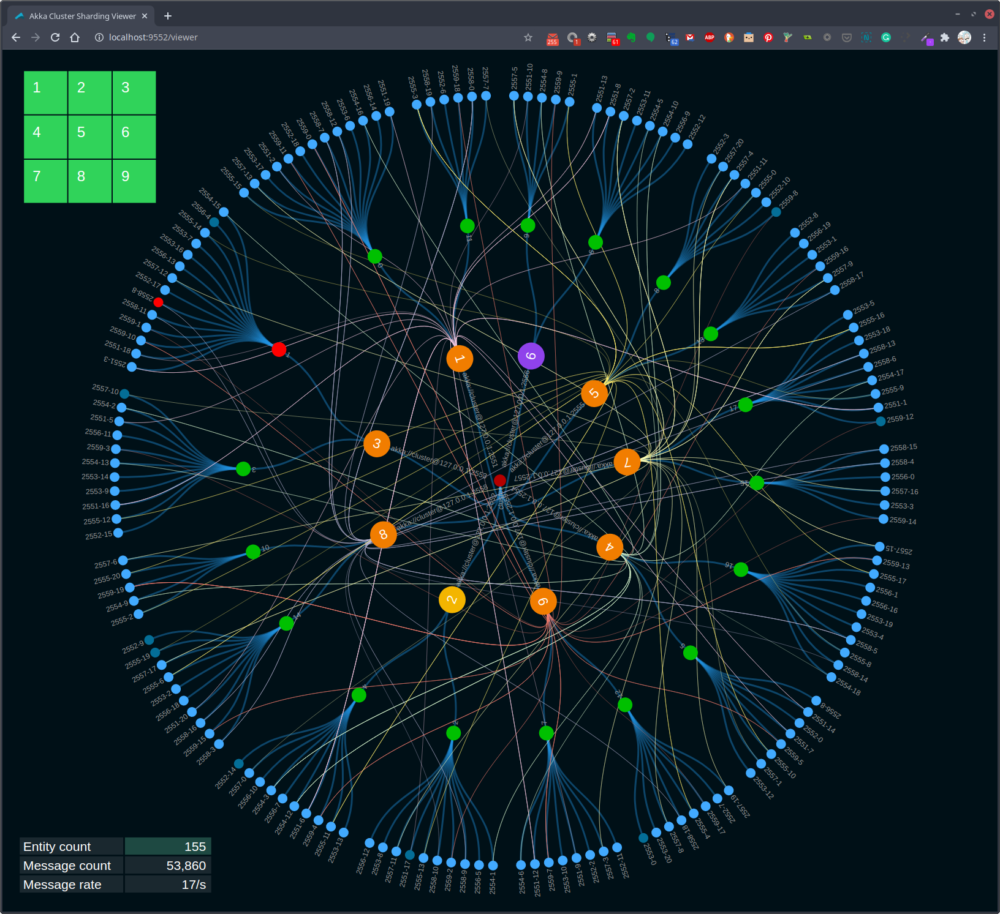

## Akka Typed Java Cluster Sharding Example

This is an Akka Cluster project that includes an example use of
[Cluster Sharding](https://doc.akka.io/docs/akka/current/typed/cluster-sharding.html),
[Cluster Singleton](https://doc.akka.io/docs/akka/current/typed/cluster-singleton.html#cluster-singleton),
the [Receptionist](https://doc.akka.io/docs/akka/current/typed/actor-discovery.html#receptionist),
[Cluster Subscriptions](https://doc.akka.io/docs/akka/current/typed/cluster.html#cluster-subscriptions),
cluster dashboard, and cluster sharding viewer.

This project is one in a series of projects that starts with a simple Akka Cluster project and progressively builds up to examples of event sourcing and command query responsibility segregation - CQRS.

The project series is composed of the following GitHub repos:
* [akka-typed-java-cluster](https://github.com/mckeeh3/akka-typed-java-cluster)
* [akka-typed-java-cluster-sbr](https://github.com/mckeeh3/akka-typed-java-cluster-sbr)
* [akka-typed-java-cluster-aware](https://github.com/mckeeh3/akka-typed-java-cluster-aware)
* [akka-typed-java-cluster-singleton](https://github.com/mckeeh3/akka-typed-java-cluster-singleton)
* [akka-typed-java-cluster-sharding](https://github.com/mckeeh3/akka-typed-java-cluster-sharding)  (this project)
* [woe-sim](https://github.com/mckeeh3/woe-sim) an example of 
[Akka Persistence](https://doc.akka.io/docs/akka/current/typed/index-persistence.html)
* [woe-twin](https://github.com/mckeeh3/woe-twin) an example of 
[Akka Persistence](https://doc.akka.io/docs/akka/current/typed/index-persistence.html)
 and 
[Akka Projections](https://doc.akka.io/docs/akka-projection/current/)

Each project can be cloned, built, and runs independently of the other projects.

### About Akka Clustering Sharding

According to the [Akka documentation](https://doc.akka.io/docs/akka/current/cluster-sharding.html#introduction),
"*Cluster sharding is useful when you need to distribute actors across several nodes in the cluster and want to be able to interact with them using their logical identifier, but without having to care about their physical location in the cluster, which might also change over time.*"

The common usage for cluster sharding is to distribute and engage with individual actors across the cluster. Each of these distributed actors is used to handle messages that are intended for a specific entity. Each entity represents a thing, such as a bank account or a shopping cart. Entities each have a unique identifier, such as an account or shopping cart identifier.

In this example project, the entities represent simple identifier and value. In a real application, entities represent real things, such as bank accounts. Each entity handles incoming messages. These messages are either commands, which are requests to chage the state of the entity. Other messages are query requests that are used to retrieve entity information.

Two actors are used to simulate clients that are sending messages to entities. The `EntityCommandActor` and the `EntityQueryActor` randomly generate messages to specific entities. These two actors are used to simulate incoming service requests. In a real implementation, the service would receive incoming messages, for example from an HTTP request, and forward those messages to specific entities to handle the request messages.

The process of forwarding these messages to the right entities, which could be distributed across multiple JVMs running in a cluster, is handled by cluster sharding. To send a message to an entity the sender simply sends the message to a shard region actor. The shard region actor is responsible for forwarding the message to the correct entity actor. The actual mechanics of this process is described in the
[Cluster Sharding concepts](https://doc.akka.io/docs/akka/current/typed/cluster-sharding-concepts.html#cluster-sharding-concepts)
section of the cluster sharding documentation.

Figure 1, Visualization of cluster sharding

The visualization in Figure 1 shows an example of cluster sharding. The blue leaf circles represent the entity actors. Each entity actor represents the state of an entity. The green circles that connect to the entity circles represent the running shard actors. In the example system there 18 shards configured. The shards connect to the orange shard region actors. These orange circles also represent other actors, such as the entity command and query actors. Also, the orange circles represent the root of the actor system on each cluster node. The grid on the top left represents the state of each of the nine node in the cluster. Green tiles in the grid indicate running cluster nodes. Nodes that are down or have no running entity actors are gray.

### How it works

Cluster sharding is started in the `Main` class. The `startClusterSharding` method contains the code for initializing cluster sharding for the demo entity actor. See the 
[Cluster Sharding](https://doc.akka.io/docs/akka/current/typed/cluster-sharding.html#cluster-sharding) docuemtation for a description of how this works.

~~~java
  private static void startClusterSharding(final ActorSystem<?> actorSystem, ActorRef<HttpServer.Statistics> httpServerActorRef) {
    ClusterSharding clusterSharding = ClusterSharding.get(actorSystem);
    clusterSharding.init(
      Entity.of(
        EntityActor.entityTypeKey,
        entityContext ->
          EntityActor.create(entityContext.getEntityId(), httpServerActorRef)
      )
      .withStopMessage(EntityActor.Passivate.INSTANCE)
    );
  }
~~~

The `EntityActor` is much like any other actor, it receives and processes incoming messages. The following `createReceive` method implementation defines the three messages that this actor handles.

~~~java
  @Override
  public Receive<Command> createReceive() {
    return newReceiveBuilder()
    .onMessage(ChangeValue.class, this::onChangeValue)
    .onMessage(GetValue.class, this::onGetValue)
    .onMessage(Passivate.class, msg -> onPassivate())
    .build();
  }
~~~

TODO

### Installation

~~~bash
$ git clone https://github.com/mckeeh3/akka-typed-java-cluster-sharding.git
$ cd akka-typed-java-cluster-sharding
$ mvn clean package
~~~

The Maven command builds the project and creates a self contained runnable JAR.

### Run a cluster (Mac, Linux, Cygwin)

The project contains a set of scripts that can be used to start and stop individual cluster nodes or start and stop a cluster of nodes.

The main script `./akka` is provided to run a cluster of nodes or start and stop individual nodes.

~~~bash
$ ./akka
~~~
Run the akka script with no parameters to see the available options.
~~~
This CLI is used to start, stop and view the dashboard nodes in an Akka cluster.

These commands manage the Akka cluster as defined in this project. A cluster
of nodes is started using the JAR file built by this project's Maven POM file.

Cluster commands are used to start, stop, view status, and open the Akka cluster dashboard.

./akka cluster start N | stop | status | dashboard [N]
./akka cluster start [N]      # Starts one or more cluster nodes as specified by [N] or default 9, which must be 1-9.
./akka cluster stop           # Stops all currently cluster nodes.
./akka cluster status         # Shows an Akka Management view of the cluster status/state.
./akka cluster dashboard [N]  # Opens an Akka cluster dashboard web page hosted on the specified [N] or default 1, which must be 1-9.
./akka cluster viewer [N]     # Opens an Akka cluster sharding viewer web page hosted on the specified [N] or default 1, which must be 1-9.

Node commands are used to start, stop, kill, down, or tail the log of cluster nodes.
Nodes are started on port 255N and management port 855N, N is the node number 1-9.

./akka node start N | stop N | kill N | down N | tail N
./akka node start N...  # Start one or more cluster nodes for nodes 1-9.
./akka node stop N...   # Stop one or more cluster nodes for nodes 1-9.
./akka node kill N...   # Kill (kill -9) one or more cluster nodes for nodes 1-9.
./akka node down N...   # Down one or more cluster nodes for nodes 1-9.
./akka node tail N      # Tail the log file of the specified cluster node for nodes 1-9.

Net commands are used to block and unblock network access to cluster nodes.

./akka net block N | unblock | view | enable | disable | partition
./akka net block N...  # Block network access to node ports, ports 255N, nodes N 1-9.
./akka net unblock     # Reset the network blocking rules.
./akka net view        # View the current network blocking rules.
./akka net enable      # Enable packet filtering, which enables blocking network access to cluster nodes. (OSX only)
./akka net disable     # Disable packet filtering, which disables blocking network access to cluster nodes. (OSX only)
./akka net localhost2  # Create or remove IP alias 127.0.0.2
./akka net partition   # Partition 127.0.0.2 on or off

~~~

The `cluster` and `node` start options will start Akka nodes on ports 2551 through 2559.
Both `stdin` and `stderr` output is sent to a log files in the `/tmp` directory using the file naming convention `/tmp/<project-dir-name>-N.log`.

Start a cluster of nine nodes running on ports 2551 to 2559.
~~~bash
$ ./akka cluster start
Starting 9 cluster nodes
Start node 1 on port 2551, management port 8551, HTTP port 9551
Start node 2 on port 2552, management port 8552, HTTP port 9552
Start node 3 on port 2553, management port 8553, HTTP port 9553
Start node 4 on port 2554, management port 8554, HTTP port 9554
Start node 5 on port 2555, management port 8555, HTTP port 9555
Start node 6 on port 2556, management port 8556, HTTP port 9556
Start node 7 on port 2557, management port 8557, HTTP port 9557
Start node 8 on port 2558, management port 8558, HTTP port 9558
Start node 9 on port 2559, management port 8559, HTTP port 9559
~~~

Stop all currently running cluster nodes.
~~~bash
$ ./akka cluster stop
Stop node 1 on port 2551
Stop node 2 on port 2552
Stop node 3 on port 2553
Stop node 4 on port 2554
Stop node 5 on port 2555
Stop node 6 on port 2556
Stop node 7 on port 2557
Stop node 8 on port 2558
Stop node 9 on port 2559
~~~

Stop node 3 on port 2553.
~~~bash
$ ./akka node stop 3
Stop node 3 on port 2553
~~~

Stop nodes 5 and 7 on ports 2555 and 2557.
~~~bash
$ ./akka node stop 5 7
Stop node 5 on port 2555
Stop node 7 on port 2557
~~~

Start node 3, 5, and 7 on ports 2553, 2555 and 2557.
~~~bash
$ ./akka node start 3 5 7
Start node 3 on port 2553, management port 8553, HTTP port 9553
Start node 5 on port 2555, management port 8555, HTTP port 9555
Start node 7 on port 2557, management port 8557, HTTP port 9557
~~~

Start a cluster of four nodes on ports 2551, 2552, 2553, and 2554.
~~~bash
$ ./akka cluster start 4
Starting 4 cluster nodes
Start node 1 on port 2551, management port 8551, HTTP port 9551
Start node 2 on port 2552, management port 8552, HTTP port 9552
Start node 3 on port 2553, management port 8553, HTTP port 9553
Start node 4 on port 2554, management port 8554, HTTP port 9554
~~~

Again, stop all currently running cluster nodes.
~~~bash
$ ./akka cluster stop
~~~

The `./akka cluster status` command displays the status of a currently running cluster in JSON format using the
[Akka Management](https://developer.lightbend.com/docs/akka-management/current/index.html)
extension
[Cluster Http Management](https://developer.lightbend.com/docs/akka-management/current/cluster-http-management.html).

### The Cluster Dashboard ###

Please see [The Cluster Dashboard](https://github.com/mckeeh3/akka-typed-java-cluster-singleton#the-cluster-dashboard) in the Cluster Singleton project. This project starts with the previous Akka Cluster Singleton project than adding an Akka Cluster Sharding example. Therefore all of the documentation of the last project also applies to this project.

### The Cluster Sharding Viewer ###

The viewer can be opened on any currently running cluster node. First, start a cluster.

~~~bash
$ ./akka cluster start
Starting 9 cluster nodes
Start node 1 on port 2551, management port 8551, HTTP port 9551
Start node 2 on port 2552, management port 8552, HTTP port 9552
Start node 3 on port 2553, management port 8553, HTTP port 9553
Start node 4 on port 2554, management port 8554, HTTP port 9554
Start node 5 on port 2555, management port 8555, HTTP port 9555
Start node 6 on port 2556, management port 8556, HTTP port 9556
Start node 7 on port 2557, management port 8557, HTTP port 9557
Start node 8 on port 2558, management port 8558, HTTP port 9558
Start node 9 on port 2559, management port 8559, HTTP port 9559
~~~

Wait for a few moments for the cluster nodes to start, then use the following command to open the cluster sharding viewer.

~~~bash
$ ./akka cluster viewer 2
~~~

Note that the above command opened the viewer using the HTTP server running on node 2.

Figure 2, Visualization of cluster sharding

The above image shows the viewer of an Akka Cluster running nine nodes. Note the colors of nodes 1 and 2. The purple color of node 1 indicates this is the oldest running node and the node where cluster singleton actors are currently running. The yellow color of node 2 shows that this is the node that the viewer web page is connected to from the browser.

The reason for highlighting the oldest node is to show how cluster singleton actors move when the oldest node changes. The image below shows what happened when node 1 is stopped. In this case, when node 1 is stopped, node 3 becomes the oldest node. Note that the color of node 3 has changed.

You can stop selected cluster nodes from the viewer's web page by either clicking one of the large node circles or be clicking nodes in the top left grid. In this example, node 1 was stopped by clicking node 1 in the grid.

Figure 3, Cluster singleton moves to new oldest node

It is also possible to highlight and track the selected entity actor. When you click one of the entity actor circles, its color changes to red. Note that entity actor 2558-8 in the above image is red. Also, note that the parent shard actor's color is red.

Highlighting entity and shard actors allows you to watch how entity and shard actors move between nodes as the cluster expands and contracts. Here, node 6 is stopped by clicking the node 6 circle or node 6 in the top-left grid.

Figure 4, Shard and entity actors restarted on new node

In the above image, you can see that entity actor 2558-8 of shard 1 has "moved" to node 4. The actors are not actually moved. A new instance of each actor is started on the new nodes. Also, note that nodes 1 and 6 in the top-left grid are dark to indicate that they are no longer running.

Figure 5, Shard and entity actors after rebalancing

Shards and their associated entity actors may be rebalanced When new nodes are added to the cluster. This rebalancing is done to more evenly distribute the workload across the cluster. 

~~~bash
$ ./akka node start 1 6
Start node 1 on port 2551, management port 8551, HTTP port 9551
Start node 6 on port 2556, management port 8556, HTTP port 9556
~~~

In the above image, cluster nodes 1 and 6 have been restarted. Note that nodes 1 and 6 changed from a gray to green background color in the top-left grid. Once these new nodes have joined the cluster, Akka cluster sharding rebalanced some of the shards to nodes 1 and 6. In this example, shard 1 with the red highlighted entity actor 2558-8 was rebalanced to node 1.

In the sample scenario shown in the above images, we tracked entity actor `2558-8`. This entity actor instance started on node 6. When node 6 was stopped, the actor was restarted on node 4. Finally, when nodes 1 and 6 were restarted it triggered a shard rebalance that resulted in entity actor `2558-8`being restarted on node 1.

The key point is that all of the recovery and rebalancing was handled by cluster sharding. This dynamic actor allocation is an example of [location transparency](https://doc.akka.io/docs/akka/current/general/remoting.html#location-transparency). 
